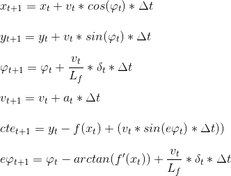
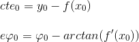

# MPC Project
Self-Driving Car Engineer Nanodegree Program

---

This project uses model predictive control to guide vehicle on the test track.

## Dependencies & Build Instructions

You can see detailed information on dependencies installation and build instructions in parent repository [here](https://github.com/udacity/CarND-MPC-Project).

## Ipopt Installation on Mac

Since homebrew/science repository is deprecated from January first I've made a fork of it and reversed the latest commits. So if you're installing Ipopt on Mac please use this command to get its homebrew formula:

```
brew tap ysavchenko/science
```

## Write Up

### The Model

We use kinematic movement model—a simple movement model which takes into consideration vehicle position, speed and orientation angle and has two actuators for changing the state: steering (orientation angle change rate) and throttle (speed change rate).

So basic state has 4 variables, but we add 2 more: position error and orientation angle error. They will be the first considered for our cost function (both should be zero).

The model is described by the state update equations (where each consecutive state is derived from the previous one). You can see the equations for each state variable below:



Where `x` and `y` is position, `v` is speed, `φ` is orientation angle, `δ` is orientation angle change rate (steering), `a` is acceleration (throttle), `cte` is position error and `eφ` is orientation error.

These equations also use `Lt` constant which depends on vehicle geomerty (the larger the constant the slower vehicle is turning), and function `f` is function of the path vehicle is supposed to be following. And `Δt` is time difference between timesteps.

### The Algorithm

Input of the algorithm is the current vehicle position, waypoints of the path it shoud be on, current speed and orientation angle. And the output should be throttle and steering values.

Below you can see the major points of the algorithm we're using:

- Estimate function from vehicle waypoints (we use 3-rd degree polynomial)
- Initialize current model state (current vehicle position, speed and angle, use estimated path function to get position and orientation errors)
- Formulate and solve linear optimization problem: 
	- Set up variables, which are vehicle state for N steps in the future and actuators for N-1 steps in the future (we do not need step N for actuators because it will affect state N+1 which we do not have in our variables)
	- Set up cost function which will be minimized: it will include position and orientation errors, difference between current and reference speed, absolute actuator values and difference between actuator values on each time step (to penalize erratic vehicle movement)
	- Set up restrictions for each variable using kinematic model equations above
- Return back actuator values (throttle and steering) from the solution (for the first timestep)

### Choosing `N` and `Δt`

Some of the metaparameters for MPC are `N` and `Δt`: number of time intervals to model and interval between those intervals.

Initially I chose `10` intervals with `0.1` seconds interval. After running some tests I noticed that green line (representing the modelled trajectory) is much shorter than yellow line (trajectory supplied by the system). This means that our model did not use much of the information provided by the system. Also `0.1` second delay was too close (exctly the same) as model latency (more on it later), so I've decided to increase time interval to `0.2` which changed modelled interval to 2 seconds which almose always matched the length of the waypoints for the vehicle provided by the system.

**UPDATE:** Final interval is `0.3` seconds to make it work better on lower speeds. During testing the speed was `25` meters per second and final submitted code has `15` meters per second to make sure MPC implementation works without delays on any test platform.

### Polynomial Fitting and MPC Preprocessing

Our model works in vehicle coordinate system and waypoits from the simulator are in global coordinate system. So the first step was to convert those waypoints to local coordinates.

Then I used `polyfit` function to fit 3-rd degree polynomial (as suggested by the learning materials) to these points. Coefficients from this polinomial later will be transferred to MPC model (they are used to estimate position and angle errors).

Then we have to assemble initial state vector. Position and angle of this vector will be zero (because we're using vehicle coordinates). Speed will be current vehicle speed and now we have to calculate initial position and angle errors. And we can do this by using formulas from the model:



Because initial `x`, `y` and `φ` values are zero we can just use the first and second polynomial coefficient values for those errors. 

### Dealing with Latency

To incorporate latency into the model we must consider the fact that even though we calculate steering and throttle immediately they will only be applied after a particular delay (`100ms`). This means that the car will contunue using current throttle and steering for the interval of this delay.

To adjust our model for such latency, before we prepare data for MPC we predict model position, angle and speed using current throttle and steering (using the same kinematic model MPC uses). It is done in `MPC::ApplyLatency` method in the code. Then we treat these values as before: transforming coordinates, fitting polynomial, calculating errors etc.

### Further Tuning

I've also done some more tuning before the model would drive vehicle efficiently on the track:

- Converting speed from miles-per-hour to meters-per-second. The speed is reported in mph, but it appears the coordinates and `Lf` is based on meters. So the speed has to be converted before applying latency to the current values
- Not using the model until speed reaches some minimum speed. Because we're using constant `N` and `Δt` we have to make sure that predicted time interval is similar to the waypoints reported by the system. And on low speeds predicted interval is much shorter so the model does not work efficiently. Quick fix was to return constant steering and throttle if speed is lower than some minimum value (`5` meters per second in final version)
- Adjusting cost function. Initial version of the cost function simply added penalizing factors without weighting them. This caused vehicle to move around the track a lot (and sometimes falling off the track, especially on high speeds). So I've started adding weights (in x10 orders of magnitude) to position error component. After reaching `1000` vehicle started following path much better, so I've stopped weights tuning at this point.

### Driving Video

Below is a screen capture for driving at `25` meters per hour target speed with `10` of `0.2` intervals in MPC model (final code has lower speed and longer intervals to make ensure model performance on slower platforms).

[](https://www.youtube.com/watch?v=VW-QnK-x1v0)

